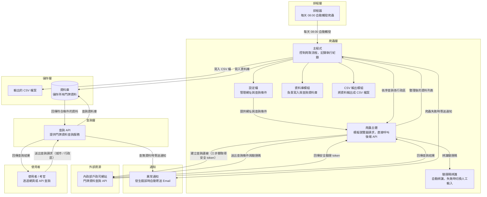
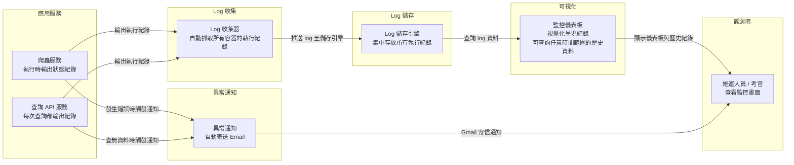
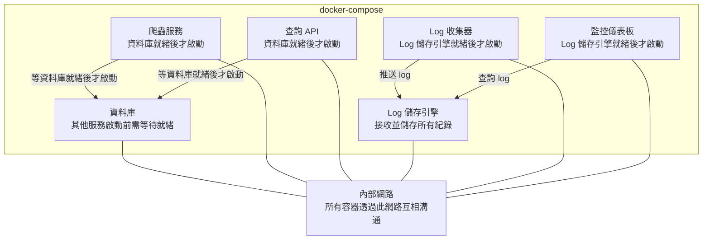
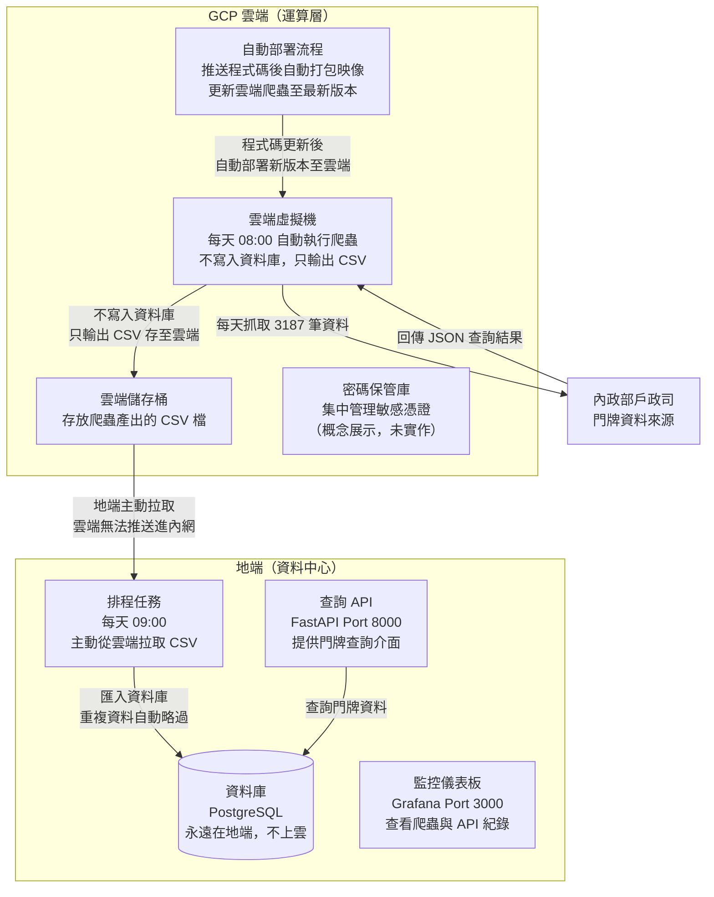

# 試題 4 - 系統架構圖

---

## 圖 1：資料流程圖



---

## 圖 2：Log 監控流程



---

## 圖 3：Docker Compose 服務關係圖



---

## 元件選型說明

### 爬蟲：requests + BeautifulSoup

| 考量 | 說明 |
|------|------|
| **為何不用 Selenium** | 透過 Chrome DevTools → Network → XHR 分析，發現查詢結果是由後端 `/inquiry/date` API 回傳的 JSON，並非動態渲染的 HTML。直接呼叫 API 更快、更穩定，且不需安裝 Chrome / ChromeDriver |
| **為何不用 Scrapy** | Scrapy 適合大規模多站點爬取，本題為單一政府網站的 API 呼叫，requests 更輕量直覺 |
| **資安優勢** | requests 只發送明確定義的 HTTP 請求，不執行 JavaScript、不載入第三方資源，攻擊面遠小於 Selenium（無瀏覽器 CVE 風險、Docker 不需 `--no-sandbox`）。取得的資料為純 JSON，不含 HTML 標籤，寫入 PostgreSQL 再由 FastAPI 輸出時，整條資料鏈均為結構化資料，有效降低 XSS / Injection 風險 |
| **Session 管理** | `requests.Session` 自動維持 cookie，模擬完整瀏覽器 session，確保 CSRF token 與 captchaKey 在同一個 session 中有效 |
| **驗證碼策略** | ddddocr 自動辨識（前 8 次）→ 辨識失敗回空字串讓 server 換圖重試 → 最後 2 次切換人工輸入，確保一定能過 |
| **Docker 映像大小** | 不需 Chrome，映像從 ~500MB 縮小至 ~150MB |

### API：FastAPI

| 考量 | 說明 |
|------|------|
| **高效能** | 基於 ASGI（Starlette），非同步處理，適合 I/O 密集的 DB 查詢 |
| **自動文件** | 內建 Swagger UI（`/docs`），免寫額外 API 文件，考官可直接互動測試 |
| **型別驗證** | Pydantic 自動驗證 Request 格式，`city` 或 `township` 遺漏時回 422 |
| **模組化設計** | config / models / db / main 四個檔案各司其職，易於維護與說明 |

### 資料庫：PostgreSQL

| 考量 | 說明 |
|------|------|
| **關聯式結構** | 門牌資料欄位固定，關聯式 DB 查詢效率高且支援索引 |
| **容器化** | `postgres:15-alpine` 映像輕量，`healthcheck` 確保爬蟲 / API 在 DB 就緒後才啟動 |
| **環境切換** | 連線參數全部透過環境變數注入，從地端切換到雲端只需改 `.env` 的 `DB_HOST` |

### Log 監控：Grafana + Loki + Promtail

| 考量 | 說明 |
|------|------|
| **為何不用 ELK** | ELK（Elasticsearch + Logstash + Kibana）記憶體需求高（Elasticsearch 建議 8GB+），地端環境負擔重；Loki 僅索引 Label，儲存成本低 |
| **自動收集** | Promtail 掛載 Docker socket，自動發現所有容器，應用程式不需修改任何程式碼 |
| **開箱即用** | Grafana datasource 與儀表板全部自動 Provisioning，`docker-compose up` 後直接看到監控畫面 |
| **歷史查詢** | Grafana 右上角選時間範圍，可回查指定日期的爬蟲執行紀錄 |

### 異常通知：Email（Gmail SMTP）

| 考量 | 說明 |
|------|------|
| **通用性** | Email 為最通用的通知管道，不需安裝額外 App，收件人帳號即可 |
| **免費** | Gmail SMTP 免費，使用 App Password 驗證，無需額外套件（Python 內建 smtplib）|
| **容錯設計** | 環境變數未設定時程式不中斷，只印 WARNING log；通知失敗也不影響主流程 |

---

## 整體架構總覽

### 全地端模式（`make local`）

```
┌─────────────────────────────────────────────────────────────────┐
│                        Docker Compose                           │
│                                                                 │
│  ┌──────────────────┐    ┌───────────────┐    ┌─────────────┐  │
│  │     crawler      │    │      api      │    │  postgres   │  │
│  │  試題1           │    │  試題2        │    │  Port 5432  │  │
│  │  requests 直打API│    │  FastAPI      │    │             │  │
│  │  ddddocr OCR     │    │  Port 8000    │    └─────────────┘  │
│  │  APScheduler     │    │  Swagger UI   │          ▲          │
│  └────────┬─────────┘    └──────┬────────┘          │          │
│           │                     │           app-network        │
│           └─────────────────────┘──────────────────┘          │
│                                                                 │
│  ┌──────────────────┐    ┌───────────────┐    ┌─────────────┐  │
│  │      loki        │◄───│   promtail    │    │   grafana   │  │
│  │  試題3           │    │  試題3        │    │  試題3      │  │
│  │  Port 3100       │    │  Docker socket│    │  Port 3000  │  │
│  └──────────────────┘    └───────────────┘    └─────────────┘  │
└─────────────────────────────────────────────────────────────────┘
                                    │
                          Email 異常通知（Gmail SMTP）
```

---

## 圖 4：雲地並行架構（符合銀行法規）



---

## 雲地並行設計說明

### 為何符合銀行法規（金管會規範）

| 規範要點 | 本架構做法 |
|----------|-----------|
| **資料不出境** | PostgreSQL 僅在地端，雲端無 DB |
| **GCS Pull Model** | 地端主動拉取，雲端無法推送進行內網 |
| **運算彈性** | 爬蟲在雲端彈性擴展，不佔用地端資源 |
| **稽核追蹤** | GCS 保留 CSV 原始記錄，地端 DB 保留入庫紀錄 |
| **金鑰管理** | Secret Manager 集中管理敏感憑證（不寫在程式碼） |

### 兩種模式對照

| 項目 | 全地端模式 | 雲地並行模式 |
|------|-----------|------------|
| 啟動指令 | `make local` | `make cloud` + GCP VM scheduler |
| 爬蟲位置 | 本機 Docker | GCP VM Docker |
| DB 位置 | 本機 PostgreSQL | **本機 PostgreSQL（不變）** |
| API 位置 | 本機 Port 8000 | 本機 Port 8001 |
| Grafana | Port 3000 | Port 3001 |
| 資料同步 | 直接寫入 | GCS → `make pull` → 本機 DB |
